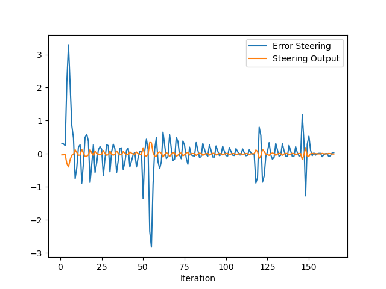
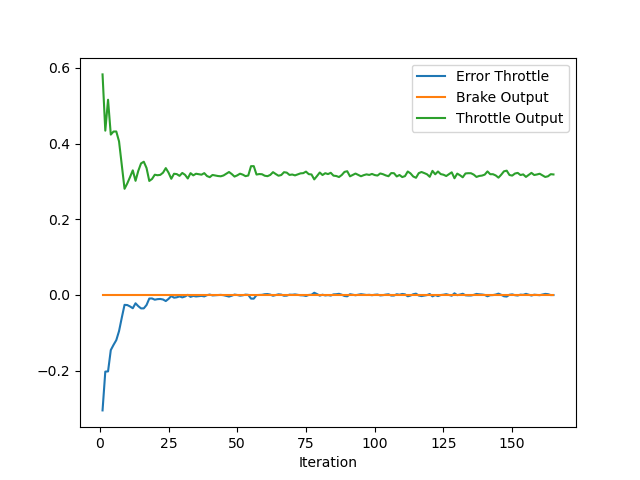
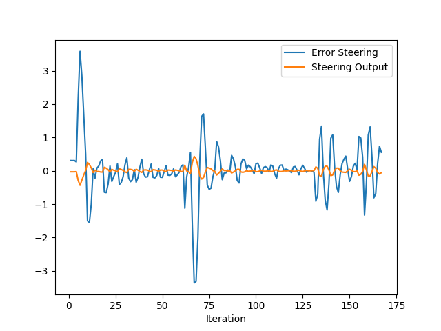
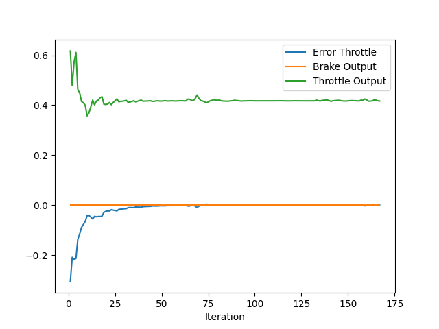

# Answers
This project implements a PID (Proportional, Integral, Derivative) controller, which is widely used for real-time autonomous systems. Below is a detailed explanation of how PID works, its effects, tuning strategies, and possible improvements.

# Plots
Two attempt of the PID outputs are seen below. First are optimized outputs and seconds are non-optimized but refined with hand.

OPtimized Outputs !!!





Refined with hand !!!






## PID Control Effects
The PID controller calculates the control command using three terms:
Note thet: Plots can be seen in plots directory.

*   Proportional (P):
    This term produces an output proportional to the current error. A higher proportional gain will result in a stronger, faster correction but can also cause overshooting if too aggressive.

*   Integral (I):
    The integral term accounts for past accumulated errors. It is particularly useful for eliminating steady-state errors but can cause overshoot if the gain is too high.

*   Derivative (D):
    This term predicts future errors by measuring the rate of change in the error. It helps to smooth out the system response and reduces overshooting and oscillations.

## Automatic PID Tuning
There are several methods to automatically tune the PID parameters. In this project, Ziegler Nichols method has been used to optimize Kp, Kd, Ki parameters.

The Ziegler–Nichols method is a popular technique for tuning PID (Proportional, Integral, Derivative) controllers. The goal is to set the controller gains to achieve a desired system response, often balancing between fast response and stabilit.

### Increase Proportional Gain (P)
* Start by setting the Integral (I) and Derivative (D) gains to zero.
* Gradually increase the Proportional (P) gain until the system begins to oscillate with a constant amplitude.
* This point where the system exhibits consistent oscillations is called the ultimate gain (Ku), and the time period of the oscillation is the ultimate period (Pu).

### Use Oscillation Data
Once determining the Ku and Pu we can run the Ziegler_optimizng.py script that reads throttle and steering errors and output Ki, Kd and Kp parameters.

### Fine-Tuning
After applying the calculated values, I made some changes to refine the system because I ve faced some problem with Kd parameter. The output of Ziegler method was 

``` Cpp
double steer_Kp = 0.82;  
double steer_Ki = 0.0007;
double steer_Kd = 1e-6; 

double throttle_Kp = 0.1; 
double throttle_Ki = 0.0009;
double throttle_Kd = 1e-6;
```

I found the optimal values are 
```Cpp
double steer_Kp = 0.78;  
double steer_Ki = 0.00087;
double steer_Kd = 0.0001;

double throttle_Kp = 0.125; 
double throttle_Ki = 0.0019;
double throttle_Kd = 0.00001;
```

## Pros of a Model-Free PID Controller
Simplicity and Ease of Implementation
* PID controllers are straightforward to design and implement. The tuning process typically involves adjusting three parameters

Versatility
* PID controllers can be applied to a wide variety of systems, making them a go-to solution in many engineering applications

No Need for a Detailed System Model
* Unlike model-based controllers (such as Model Predictive Control or LQR), PID controllers do not need an accurate model of the system being controlled

Low Computational Cost
* The computational requirements for a PID controller are minimal, making them suitable for real-time applications 

## Cons of a Model-Free PID Controller
Limited Performance in Complex Systems
* Since a PID controller does not rely on a model of the system, it may struggle to handle highly system dynamics.

Suboptimal Tuning
* Tuning a PID controller can be challenging in some systems, especially without a model to guide the process. SOmetimes PID should be tunned adaptively based on system state

No Predictive Capabilities
* Unlike model-based controllers, which can anticipate future states of the system, a PID controller reacts only to current and past errors

# Improvements
* Better refinement tecniques or parameters can be used to run PID controller
* Implement adaptive PID parameters that can adjust in real-time based on system state
* Add a feedforward control component to preemptively adjust the control signal based on known disturbances or inputs